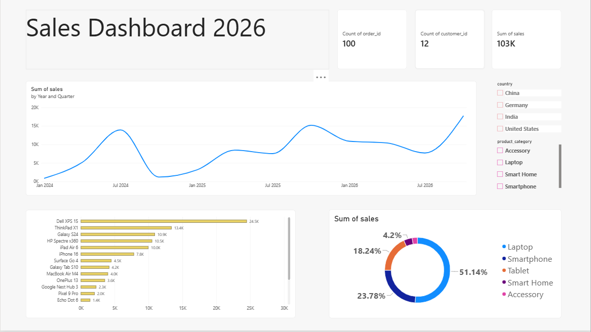
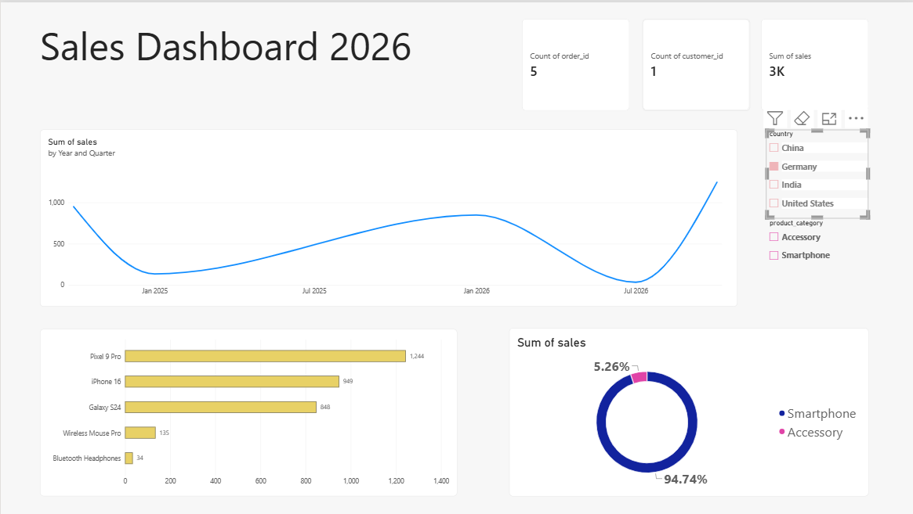
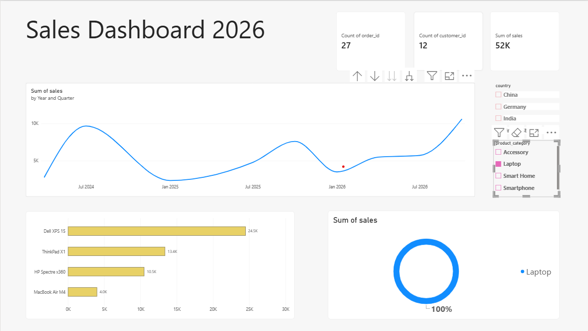

# 📊 Power BI Sales Dashboard

## 👋 About Me
I'm Abbas Raza, a final-year Computer Science student based in Lucknow, India, currently preparing for placements as an aspiring Data Analyst. This is my first hands-on Power BI project, built while learning data visualization and BI reporting.

## 📌 Project Overview
This dashboard analyzes sales performance across products, regions, and time periods. It was built to practice core Power BI skills — data visualization, interactive filtering, and dashboard design — as part of my preparation for Data Analyst roles.

## 🎯 What This Dashboard Shows
- **Sales Trend Over Time**: A line chart tracking total sales by year and quarter, helping spot seasonal patterns and growth trends.
- **Top Products by Sales**: A horizontal bar chart ranking products by total revenue generated.
- **Category-wise Sales Distribution**: A donut chart breaking down sales share across product categories.
- **Key Metrics at a Glance**: Summary cards showing total order count, total customer count, and total sales value.

## 🎛️ Interactive Filters
- **Country Filter**: Instantly filter all visuals by region to compare performance across markets.
- **Product Category Filter**: Narrow down the view to a specific category to analyze category-level trends.
- **Cross-filtering**: Clicking on any chart segment automatically filters the rest of the dashboard, letting users drill into specific products or categories interactively.

## 🛠️ Tools Used
- **Power BI Desktop** — for building the report and visuals
- **DAX (Data Analysis Expressions)** — for calculated fields and measures
- **Power Query** — for shaping and cleaning the underlying data

## 📷 Screenshots

### Full Dashboard View

*Complete view of all KPIs and visuals with no filters applied.*

### Filtered by Country

*Dashboard filtered to show sales data for a specific country — demonstrates real-time interactivity.*

### Filtered by Product Category

*Dashboard filtered to a specific product category, showing how visuals update dynamically.*

## 📂 Files
- `my first dashboard.pbix` — open in Power BI Desktop to explore the full interactive report

## 🌱 What I'm Learning Next
Continuing to build on this foundation by exploring more advanced DAX measures, custom visuals, and eventually connecting Power BI directly to a SQL Server data warehouse for an end-to-end data pipeline project.
